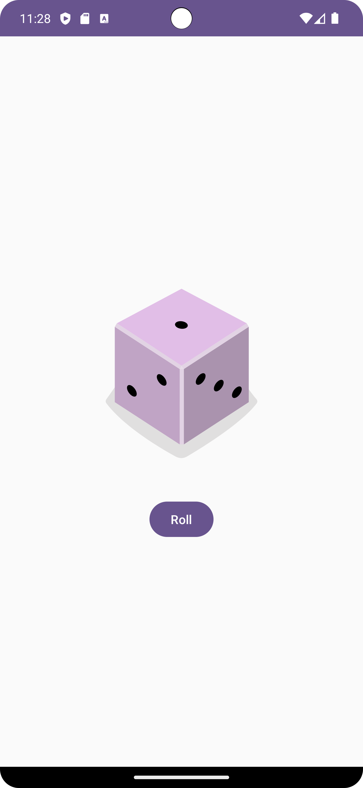

# Dice Roller App

A simple app that displays a dice that can be rolled. It's developed using Jetpack Compose components like ```Column```, ```Button```, ```Text```, ```Image```, and ```Modifier```.

<p align="center">
  
</p>